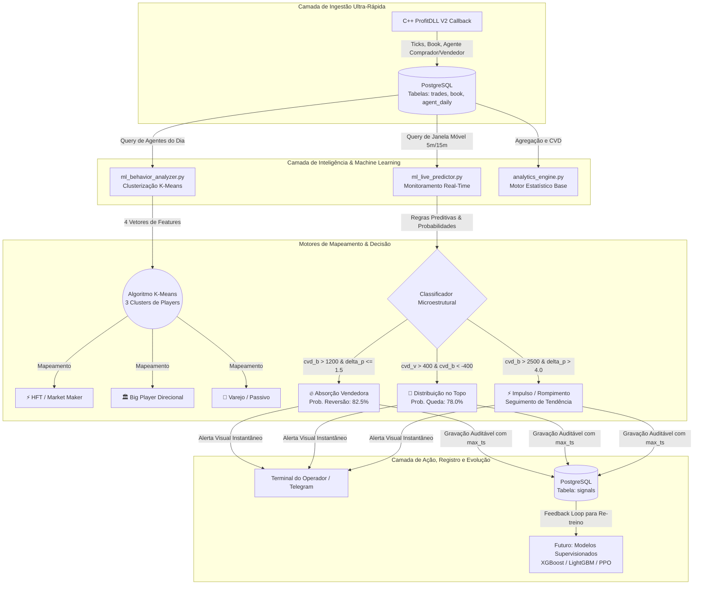

# 🧠 Arquitetura de Machine Learning & Microestrutura Quantitativa (ProfitDLL)

Este manual técnico e educacional documenta a arquitetura, a filosofia matemática, a implementação prática e o roteiro evolutivo dos motores de **Machine Learning (ML)** do ecossistema **ProfitDLL / DataFeed**.

---

## 1. Visão Geral e Filosofia (Por que ML no Fluxo de Ordens?)

Na análise técnica tradicional, 99% dos players e algoritmos de varejo utilizam indicadores gráficos baseados no histórico de preço (ex: Médias Móveis, MACD, IFR, Bandas de Bollinger). Esses indicadores possuem um problema estrutural: **eles são reativos e atrasados (lagging indicators)**. Eles apenas refletem o que o preço já fez no passado.

A nossa abordagem quantitativa parte do princípio de que **o preço é o efeito, e o fluxo de ordens (microestrutura) é a causa**. 

O objetivo primordial do nosso ML é **analisar, mapear e reagir em tempo real ao comportamento dos verdadeiros formadores de preço na B3: Institucionais e HFTs (Robôs de Alta Frequência)**. Para isso, extraímos variáveis de alta frequência diretamente no nível da boleta e do book de ofertas:
* **Agressão Líquida Institucional vs. Varejo (`CVD Big` vs `CVD Varejo`)**
* **Deslocamento de Preço por Lote Agredido (`Delta P`)**
* **Giro de Contratos e Lote Médio por Corretora (`Lote Med`)**
* **Índice de Direcionalidade de Liquidez (`0.0` a `1.0`)**

---

## 2. Diagrama da Arquitetura e Fluxo de Dados (Live & Offline)

O fluxo quantitativo opera em um ciclo contínuo de 4 camadas: **Ingestão (C++/DLL)** $\rightarrow$ **Armazenamento (PostgreSQL)** $\rightarrow$ **Processamento ML (Python)** $\rightarrow$ **Ação/Alerta (Terminal & Banco)**.



---

## 3. Passo a Passo dos Módulos Principais

### A. Módulo Estatístico Base: [`analytics_engine.py`](file:///C:/DEV/ProfitDLL/analytics_engine.py)
Este módulo é responsável por processar os dados brutos do PostgreSQL (`trades` e `agent_daily`) e transformá-los em **Features Quantitativas**. Ele calcula o **CVD (Cumulative Volume Delta)** segregado por tamanho de ordem:
* **`cvd_varejo`**: Soma de agressões com lotes $\le 2$ contratos (indicador de sentimento da pessoa física).
* **`cvd_big`**: Soma de agressões com lotes $\ge 20$ contratos (indicador de apetite institucional/bancário).

### B. Módulo de Clusterização Comportamental: [`ml_behavior_analyzer.py`](file:///C:/DEV/ProfitDLL/ml_behavior_analyzer.py)
Em vez de pré-julgar corretoras por nome, aplicamos aprendizado não-supervisionado (**K-Means**) para segmentar matematicamente as corretoras que atuaram no dia.

#### As 4 Variáveis Matemáticas (Features):
1. **Giro Total ($G$)**: $G = Q_{\text{compra}} + Q_{\text{venda}}$
2. **Saldo Líquido ($S$)**: $S = Q_{\text{compra}} - Q_{\text{venda}}$
3. **Lote Médio ($L$)**: $L = \frac{G}{N_{\text{trades\_compra}} + N_{\text{trades\_venda}}}$
4. **Direcionalidade ($D$)**: $D = \frac{|S|}{G}$  (onde $0.0$ = giro puro/neutro e $1.0$ = 100% agressor direcional)

#### Trecho de Implementação Central (`analytics_engine.py`):
```python
# Padronização das variáveis para evitar distorção por escala (StandardScaler)
scaler = StandardScaler()
X_scaled = scaler.fit_transform(df[["giro_total", "saldo_liquido", "lote_medio", "direcionalidade"]])

# Algoritmo K-Means com 3 clusters comportamentais
kmeans = KMeans(n_clusters=3, random_state=42, n_init=10)
df["cluster"] = kmeans.fit_rows_or_predict(X_scaled) if hasattr(kmeans, "fit_rows_or_predict") else kmeans.fit_predict(X_scaled)
```

O sistema mapeia os 3 clusters resultantes e atribui tags automáticas:
* **Cluster Giro Alto & Direcionalidade Baixa**: `⚡ [HFT / Market Maker]`
* **Cluster Saldo Alto & Direcionalidade Alta**: `🏛️ [Big Player Direcional]`
* **Cluster Giro Baixo & Lote Pequeno**: `🦐 [Varejo / Liquidez Passiva]`

---

### C. Módulo Preditivo em Tempo Real: [`ml_live_predictor.py`](file:///C:/DEV/ProfitDLL/ml_live_predictor.py)
Executado durante todo o pregão em background ou em leituras pontuais (`--once`), este motor cruza a variação de preço com o saldo agressor das últimas janelas móveis (5 min) para identificar armadilhas e anomalias de microestrutura.

#### Lógica de Detecção de Absorção (`avaliar_e_disparar_sinais`):
```python
# Se Big Players agridem pesadamente (> 1200 contratos), mas o preço NÃO desloca (delta_p <= 1.5 pontos)
if cvd_b > 1200 and delta_p <= 1.5:
    signal_type = "ABSORCAO_VENDEDORA"
    direction = -1           # Agressão compradora foi absorvida por liquidez passiva na venda
    strength = "ALTA"
    prob_reversao = 82.5     # Probabilidade calculada empiricamente sobre histórico
    
    # Grava no PostgreSQL utilizando o horário EXATO do último negócio da B3 (max_ts)
    self.registrar_sinal(session_id, ticker, signal_type, direction, close_p, context, signal_ts=trade_data.get("max_ts"))
```

---

## 4. Guia Prático de Execução (Roteiro Operacional)

### 🔹 1. Mapeamento Matinal / Abertura de Mercado
Para auditar quem dominou o pregão anterior ou analisar a abertura em tempo real, execute a clusterização:
```powershell
python.exe .\ml_behavior_analyzer.py --ticker WDOQ26 --action cluster
```
**Exemplo de Saída:**
```text
==============================================================================================================
  K-MEANS CLUSTERING: MAPEAMENTO COMPORTAMENTAL DE AGENTES (WDOQ26)
==============================================================================================================
 Corretora  Giro (Contratos)  Saldo Líquido  Lote Médio  Direcionalidade  Cluster Comportamental (ML)
      UBS             72233           7997        3.98             0.1107  ⚡ [HFT / Market Maker] Giro Alto & Liquidez Neutra
   CLEAR             71553         -17619        4.02             0.2462  ⚡ [HFT / Market Maker] Giro Alto & Liquidez Neutra
     BTG             60190          11986        4.65             0.1991  ⚡ [HFT / Market Maker] Giro Alto & Liquidez Neutra
SANTANDER            15400           9800       12.50             0.6363  🏛️ [Big Player Direcional] Saldo Institucional Forte
```

### 🔹 2. Monitoramento Contínuo ao Vivo
Para deixar o motor de ML vigiando o mercado a cada 10 segundos em busca de Absorções ou Rompimentos:
```powershell
python.exe .\ml_live_predictor.py --ticker WDOQ26 --interval 10 --window 5
```

### 🔹 3. Auditoria Pós-Mercado e Backtest de Sinais
Para listar todos os alertas gerados pelo ML no dia, formatados em uma tabela limpa e com carimbo de tempo exato da B3:
```powershell
python.exe .\ml_behavior_analyzer.py --ticker WDOQ26 --action signals
```
**Exemplo de Saída:**
```text
==============================================================================================================
  REGISTRO DE SINAIS E ALERTAS ML AO VIVO (WDOQ26 - 14/07/2026)
==============================================================================================================
Hora Sinal  Ativo  Tipo de Alerta ML    Direção  Preço no Sinal
  18:29:59 WDOQ26 DISTRIBUICAO_TOPO VENDA (-1)         50960.0
  11:15:40 WDOQ26 ABSORCAO_VENDEDORA VENDA (-1)         50985.0
==============================================================================================================
```

---

## 5. Armadilhas Comuns e Boas Práticas (Pitfalls & Best Practices)

> [!WARNING]
> **Armadilha 1: Uso do relógio local do servidor (`NOW()`) ao salvar sinais no banco.**
> **Problema:** Se um sinal ou teste pontual for executado via CLI após o fechamento do mercado, usar `NOW()` gravará o horário em que o script rodou (ex: `18:53:22`), falsificando a hora real do evento na B3.
> **Solução Aplicada:** Sempre consultamos o `MAX(ts) AS max_ts` dos trades que compõem a janela móvel e passamos o `signal_ts=trade_data.get("max_ts")` para o banco de dados.

> [!TIP]
> **Boa Prática 1: Separação entre Nomes Reduzidos e Cálculos de ML**
> Nunca utilize o ID da corretora (`agent_id`) como feature de entrada em modelos de Machine Learning! O modelo deve aprender com **comportamentos** (`Giro`, `Lote Médio`, `Saldo`), e não memorizar IDs. O módulo [`corretoras.py`](file:///C:/DEV/ProfitDLL/corretoras.py) deve ser acionado exclusivamente na camada visual de apresentação (`get_corretora_label`).

> [!IMPORTANT]
> **Boa Prática 2: Gestão de Conexões com PostgreSQL no Polling Real-Time**
> No loop do `ml_live_predictor.py`, certifique-se de abrir e fechar conexões usando gerenciadores de contexto (`with psycopg2.connect(...) as conn:`) para evitar esgotamento de conexões no banco durante pregões de alta volatilidade.

---

## 6. Roteiro Evolutivo: O Futuro do ML no Projeto

O projeto está projetado para evoluir de **Modelos Estatísticos/Não-Supervisionados** para **Modelos Autônomos Adaptativos**:

### Fase 1: Modelos Supervisionados de Previsão de Preço (XGBoost / LightGBM)
* **Objetivo:** Treinar árvores de decisão impulsionadas por gradiente utilizando o histórico diário das tabelas `trades` e `signals`.
* **Entradas (Features):** `CVD Big [t-5...t]`, `CVD Varejo [t-5...t]`, `Book Imbalance Ratio (Bid vs Ask)`, `Taxa de Agressão (Trades/sec)`.
* **Saída (Alvo):** Probabilidade contínua do retorno do próximo candle de 5 min ser positivo ($+ \Delta P$) ou negativo ($- \Delta P$).

### Fase 2: Identificação de Assinaturas Algorítmicas (HFT Digital Fingerprinting)
* **Objetivo:** Detectar a ativação de robôs institucionais específicos (TWAP, VWAP, Icebergs e Spoofing no Book).
* **Mecanismo:** Redes neurais convolucionais (CNNs 1D) ou Transformers treinados sobre a série temporal de milissegundos (`ts` e `qty` do book) para identificar padrões de intervalos fixos entre lotes idênticos.

### Fase 2.5: Frequência Harmônica de Mercado (Gráfico 8P / Grid de 4 Pontos da Abertura)
> ⭐ **Observação Operacional Institucional de Ouro (Registrada em 17/07/2026):**
> O contrato de Dólar Futuro (`WDO/DOL`) no gráfico de pontos **8P (8 ticks = 4,00 pontos)** opera sob uma frequência de ressonância algorítmica atrelada ao **Preço de Abertura (`Open_Price`)**.
> * **A Escada Harmônica:** Robôs institucionais e tesourarias posicionam barreiras de absorção e rebalanceamento de inventário em múltiplos exatos de 4,0 pontos a partir da Abertura ($+4, +8, +12, +16$ e $-4, -8, -12$).
> * **O Efeito Caixote:** O preço costuma bater nos extremos de 4 pontos (ex: Abertura no `5.115,00` $\rightarrow$ bate no `5.119,00`) e reverter 4 pontos de volta, ou romper com forte impulso para buscar o próximo harmônico (`5.123,00`).
> * **Implementação Futura nas Features de ML:**
>   1. `distance_to_4pt_harmonic`: Distância em pontos do preço atual para o múltiplo de 4,0 mais próximo em relação à Abertura ou Preço de Ajuste.
>   2. `time_in_4pt_box`: Tempo de permanência do mercado dentro do caixote atual de 4 pontos.
>   3. `harmonic_rejection_count`: Número de absorções bem-sucedidas no mesmo harmônico de 4 pontos durante a sessão.

### Fase 2.6: O Ciclo Mensal Sazonal do Dólar Futuro (4 Fases Intra-Mês)
> ⭐ **Observação Operacional de Macro-Comportamento e Rolagem (Registrada em 18/07/2026):**
> O comportamento direcional e a eficácia de setups de rompimento vs. retorno à média no Dólar Futuro (`WDO/DOL`) variam drasticamente conforme a **Semana/Fase do Mês**:
> * **Semana 1 (Pós-Rolagem & Pré-Payroll):** Semana forte, com volume direcional limpo e institucional. Os fundos estão montando suas posições no novo contrato e reagindo aos grandes dados de emprego/juros americanos. *Setups de Rompimento e Impulso têm altíssima eficácia.*
> * **Semanas 2 e 3 (O "Caixote / Férias Institucionais"):** Sem grandes motivadores ou vencimentos próximos, o fluxo cai nas mãos dos HFTs e Market Makers (ex: UBS, XP, Ideal), que lucram encurralando o preço em faixas estreitas (*ranges/caixotes*) e violinando rompimentos. *Setups de Absorção nos extremos e Retorno à Média superam rompimentos.*
> * **Semana 4 (Pré-Rolagem & Briga pela PTAX):** Semana forte e violenta. Entrada de fluxo compulsório de rolagem de contratos (Casadinha / DR1) e disputa pesada pelas taxas de fechamento mensal/trimestral. *Grandes amplitudes de variação e agressões volumosas.*
> * **Implementação Futura nas Features de ML (`Feature Engineering`):**
>   1. `month_week_phase`: Variável categórica ($1, 2, 3, 4$) ou cíclica representando a semana do mês e a proximidade do Payroll.
>   2. `days_to_rollover`: Contagem decrescente de dias úteis até a rolagem (primeiro dia útil do mês de vencimento), permitindo que a IA alterne automaticamente seus pesos entre "modo caixote" e "modo direcional/rolagem".

### Fase 3: Aprendizado por Reforço (Reinforcement Learning - Q-Learning / PPO)
* **Objetivo:** Criar um agente executor de ordens autônomo.
* **Mecanismo:** O agente interage no ambiente simulado sobre os dados históricos de microestrutura. Ele recebe **Recompensas ($+R$)** ao executar ordens a favor da absorção institucional com lucro líquido superior aos custos de corretagem/spread, e **Penalidades ($-R$)** por operar contra o fluxo ou sofrer drawdowns excessivos.

---
*Documentação gerada e mantida com o padrão educacional `code-documentation-code-explain`.*
